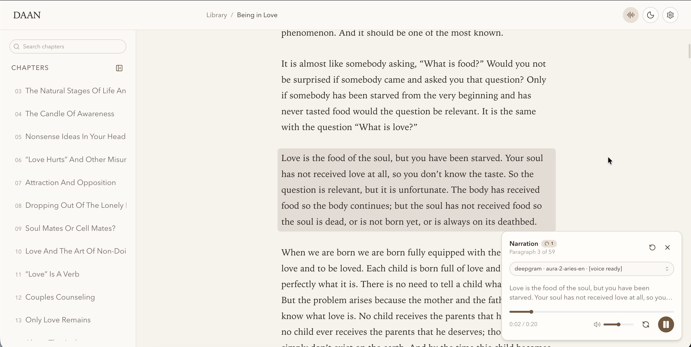

# Daan (دان)

> An intelligent, distraction-free book reader and AI audiobook narrator.
>
> **Why "Daan"?** In Persian, **Daan** (دان) is the root of knowing and wisdom (*dānestan* / دانستن), and a vessel that holds knowledge.



---

## Highlights & Features

- **Automatic Chapter & Content Detection**: Drag and drop PDF or EPUB files. Daan parses structure, chapter titles, headings, and text formatting automatically.
- **AI-Powered Audio Narration**: Listen to any chapter with natural text-to-speech. Paragraphs are hashed, normalized, and pre-buffered using background workers.
- **TTS Engine Flexibility**: Built-in support for **Deepgram Aura** and any **OpenAI-compatible** speech API, complete with voice previews and model search in Settings.
- **Interactive Audio Reader**: Floating player with real-time seeking, volume control, paragraph highlight synchronization, click-to-narrate jumping, and persistent playback state per book.
- **Fast Chapter Search**: Instant search through chapter titles and contents with debounced indexing and direct paragraph scrolling.
- **Editorial, Eye-Friendly Design**: Warm, tactile typography designed for comfortable long-form reading, customizable dark/light themes, collapsible sidebar, and responsive layouts.
- **Local-First & Private**: Books, chapters, and generated audio are stored locally on your machine with SQLite (Drizzle ORM) and Bunqueue. Optional system-wide SOCKS5 proxy support.
- **Modern Monorepo Architecture**: Powered by Bun, React 19, Mantine UI v9, TanStack Router/Query, Hono, oRPC, and Electrobun for desktop.

---

## Tech Stack

- **Runtime & Package Manager**: [Bun](https://bun.sh)
- **Frontend**: React 19, [Mantine UI v9](https://mantine.dev), Tailwind CSS, TanStack Router & Query
- **Backend & RPC**: [Hono](https://hono.dev), [oRPC](https://orpc.unnoq.com)
- **Database & Queue**: SQLite via [Drizzle ORM](https://orm.drizzle.team), [bunqueue](https://bunqueue.dev)
- **Desktop Shell**: [Electrobun](https://electrobun.dev)
- **Document Processing**: [unpdf](https://github.com/unjs/unpdf), custom EPUB/PDF parser

---

## Quick Start

### 1. Prerequisites

- [Bun](https://bun.sh) (v1.2+ recommended)

### 2. Install Dependencies

```bash
bun install
```

### 3. Setup Database

```bash
bun run db:push
```

### 4. Run Development Server

```bash
bun run dev
```

- Web App: [http://localhost:3007](http://localhost:3007)
- API Server: [http://localhost:3006](http://localhost:3006)

To run as a native desktop application:

```bash
bun run dev:desktop
```

---

## Roadmap

- [ ] **AI Chat with Book Content**: Converse with your books, ask questions, and explore ideas grounded directly in the text.
- [ ] **Translate Content Before TTS**: On-the-fly translation of paragraphs into other languages prior to voice synthesis.
- [ ] **Adaptive Narration Styles with LLM**: Restyle and adapt the narrative tone (e.g., dramatic, conversational, simplified, or storybook) using LLMs before generating audio.

---

## License

MIT
